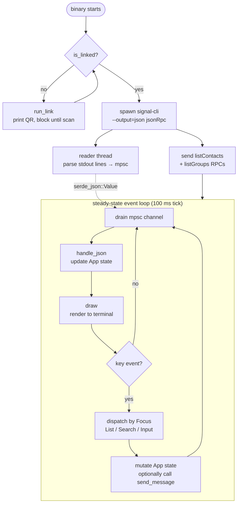
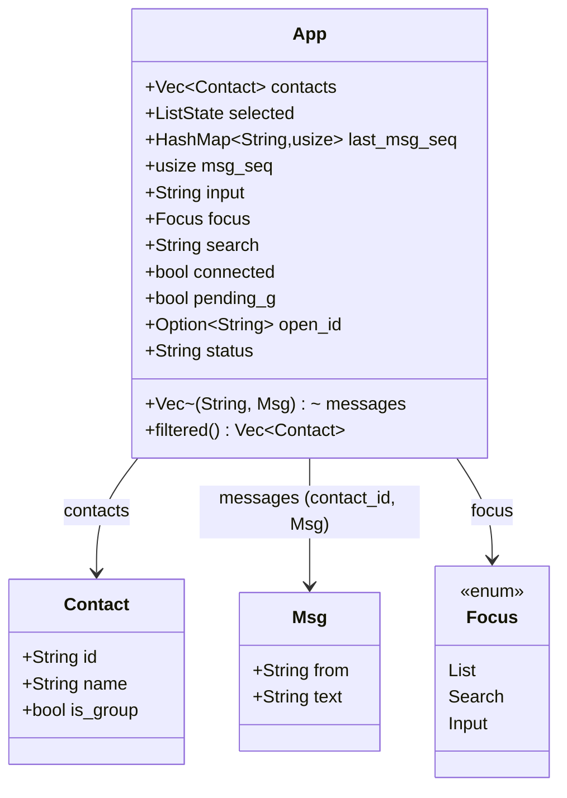
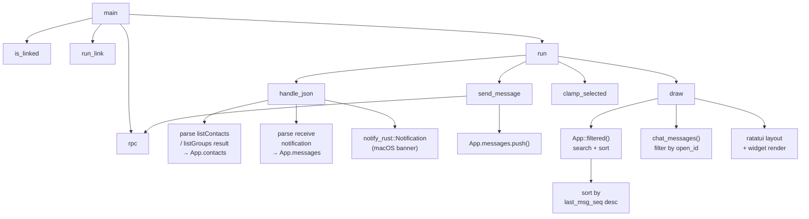

# signal-tui — Architecture

## High-level: startup + steady-state data flow



## App state



**Key invariants:**

- `open_id` is set when the user opens a chat (`i`/`Enter` from List focus). It is **decoupled from the sorted list index** — sort re-orders don't affect the active conversation.
- `messages` is a flat `Vec` keyed by `contact_id`; filtered on render by `open_id` via `chat_messages()`.
- `last_msg_seq` is a monotonic counter per contact, incremented on every send/receive. `filtered()` sorts by this value descending so the most recently active contact is always first.

## Low-level: function call graph



## IPC: JSON-RPC message shapes

### Outbound (signal-tui → signal-cli)

```json
{ "jsonrpc": "2.0", "id": 1, "method": "listContacts", "params": {} }
{ "jsonrpc": "2.0", "id": 2, "method": "listGroups",   "params": {} }
{ "jsonrpc": "2.0", "id": 100, "method": "send",
  "params": { "recipient": ["+48123456789"], "message": "hello" } }
{ "jsonrpc": "2.0", "id": 101, "method": "send",
  "params": { "groupId": "abc123==", "message": "hi group" } }
```

### Inbound (signal-cli → signal-tui)

```json
// Contact list response
{ "jsonrpc": "2.0", "id": 1,
  "result": [{ "number": "+48123", "profile": { "givenName": "Alice" } }] }

// Incoming message push
{ "jsonrpc": "2.0", "method": "receive",
  "params": { "envelope": {
    "sourceNumber": "+48123", "sourceName": "Alice",
    "dataMessage": { "message": "hey",
                     "groupInfo": { "groupId": "abc==" } } } } }
```
