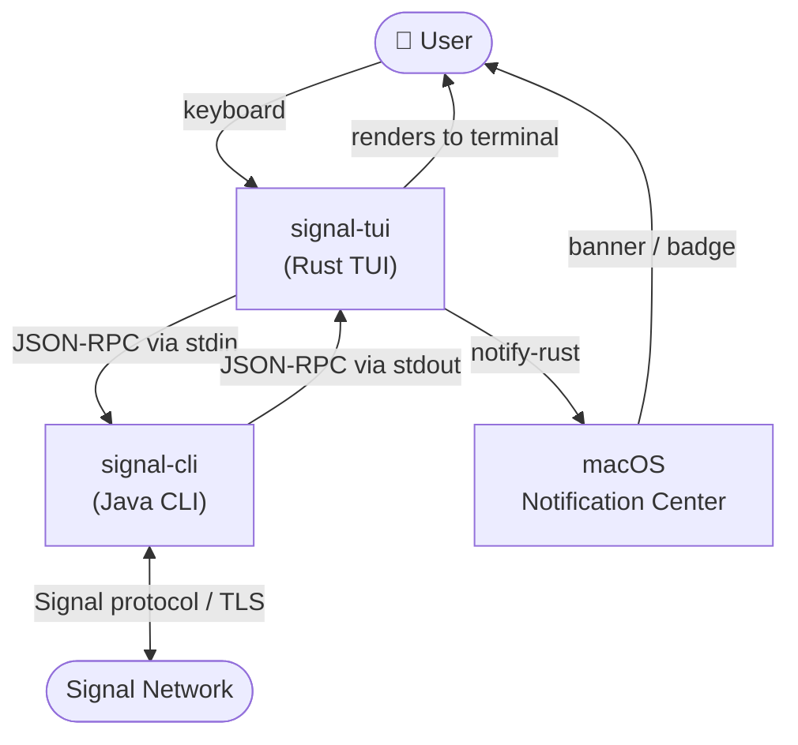
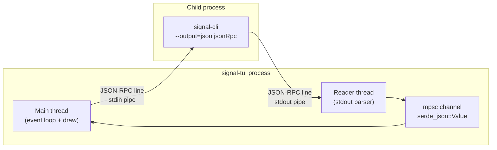

# signal-tui — Overview

Terminal UI for Signal messaging. Wraps `signal-cli` and exposes a keyboard-driven chat interface in the terminal.

## System context

## Runtime topology

## Technology stack

| Concern | Crate / Tool | Notes |
|---|---|---|
| TUI rendering | `ratatui` + `crossterm` | Layout, widgets, raw terminal I/O |
| Signal backend | `signal-cli` (subprocess) | Protocol, crypto, account storage |
| IPC | `serde_json` + `std::process` | JSON-RPC 2.0 over child process pipes |
| Notifications | `notify-rust` | macOS `NSUserNotificationCenter` — no app bundle required |
| Theme | dim-sum palette (`Color::Rgb`) | Dark muted color scheme from `dawidsok/dim-sum-theme` |
| Distribution | Homebrew (`dawidsok/tap`) | `brew install signal-tui` |
