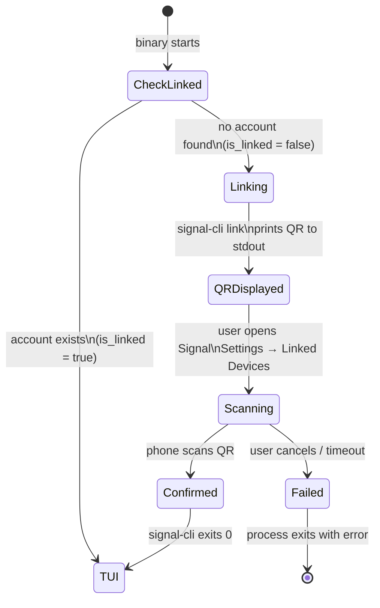
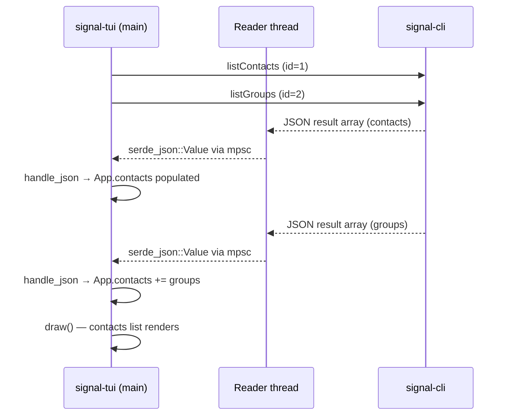
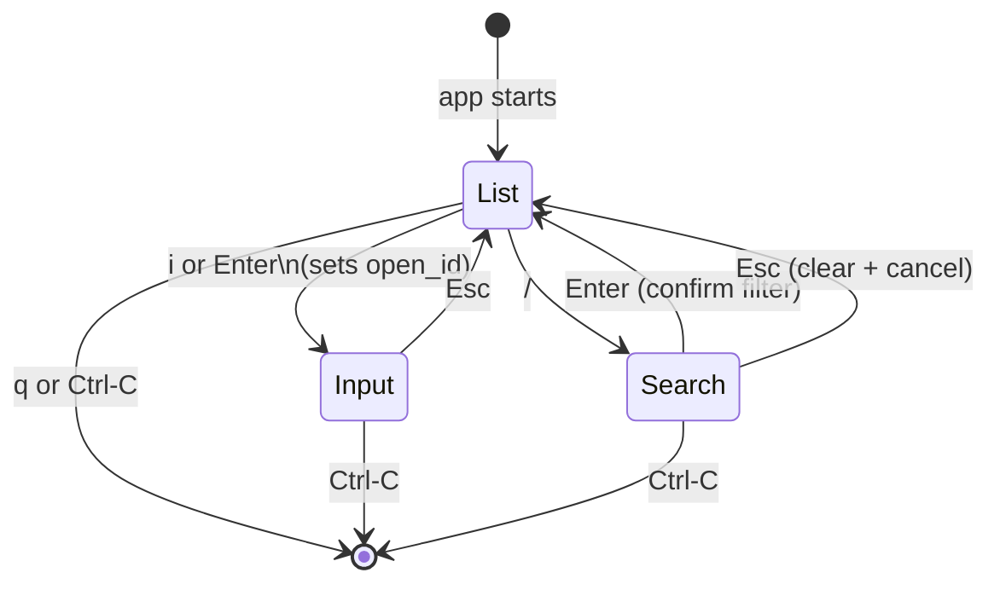
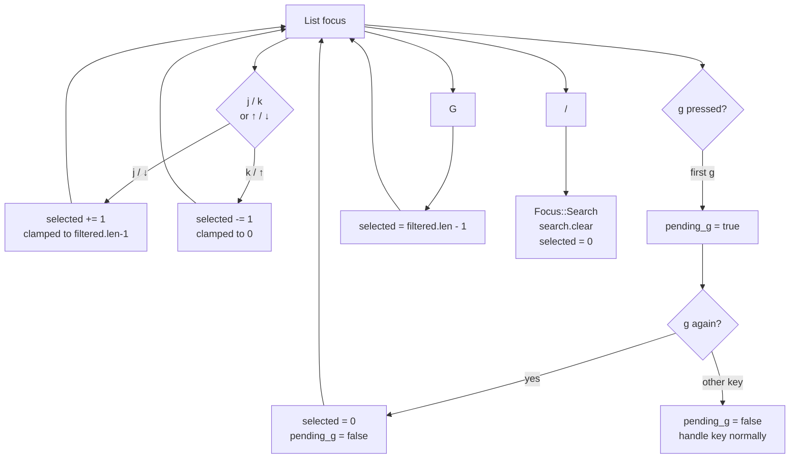
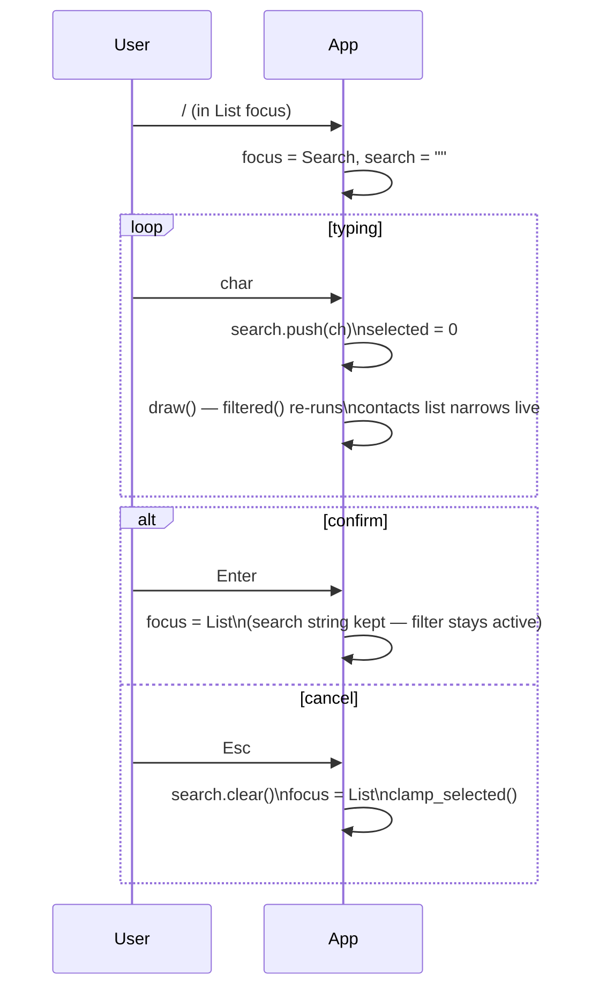
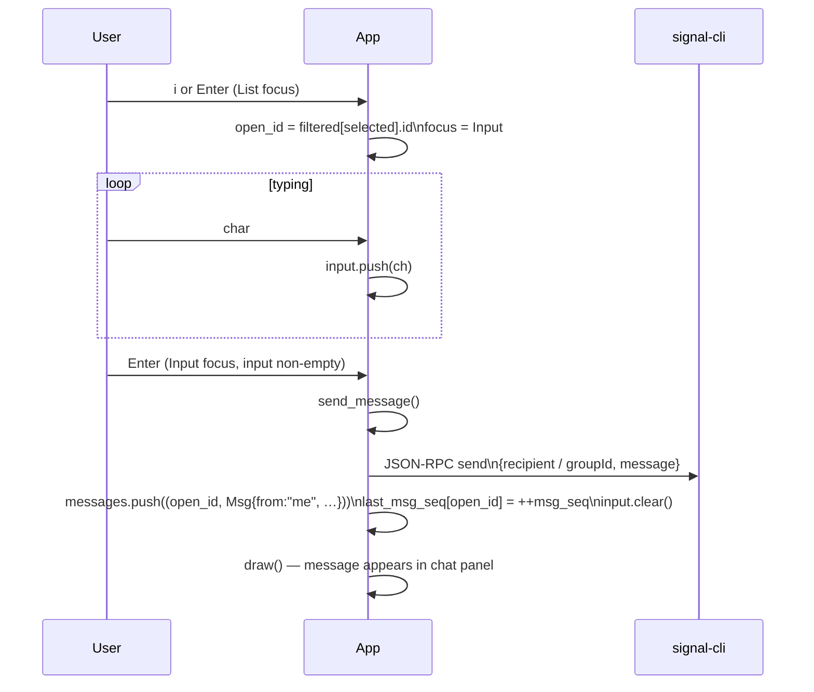
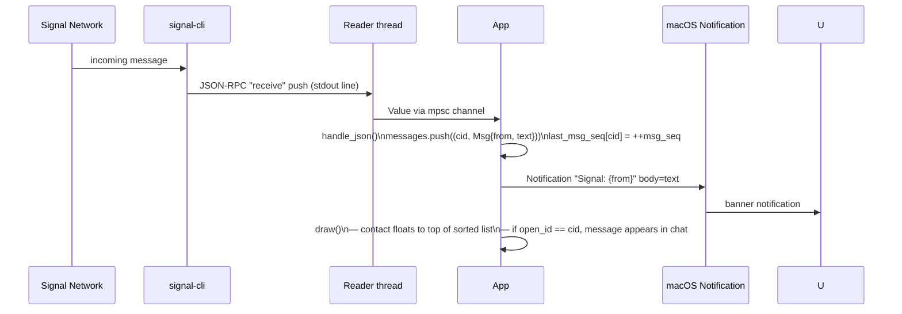

# signal-tui — User Flows

## 1. First-run device linking

Runs once, before the TUI starts. signal-cli prints a QR code to the terminal.



## 2. Startup — contact loading



## 3. Focus state machine



## 4. Contact navigation (List focus)



## 5. Contact search / filter



## 6. Sending a message



## 7. Receiving a message



## 8. Contact sort order

Contacts are sorted by `last_msg_seq` (descending) on every render. The most recently active contact is always at the top.

```mermaid
flowchart LR
    S[("last_msg_seq\nHashMap")] --> F["App::filtered()\n1. apply search filter\n2. sort by seq desc"]
    F --> L[Contacts list\n(rendered order)]

    EV1[send_message] -- "seq++" --> S
    EV2[handle_json\n(receive)] -- "seq++" --> S
```
